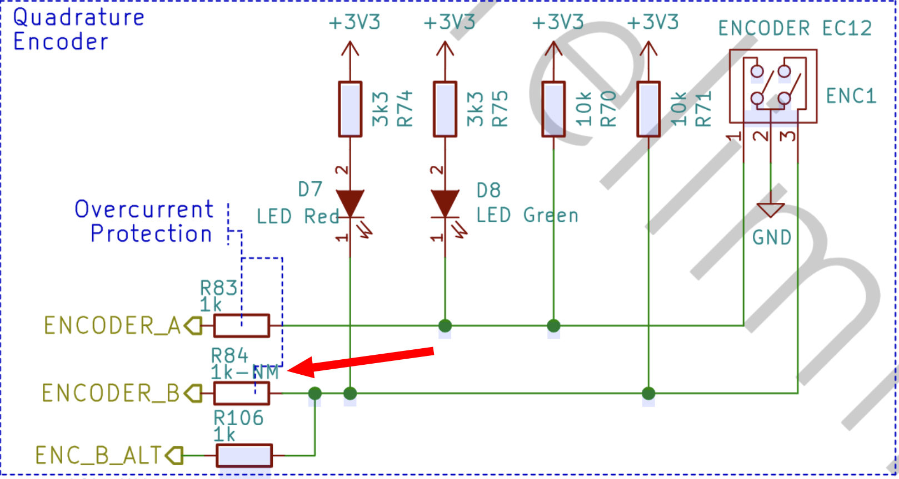
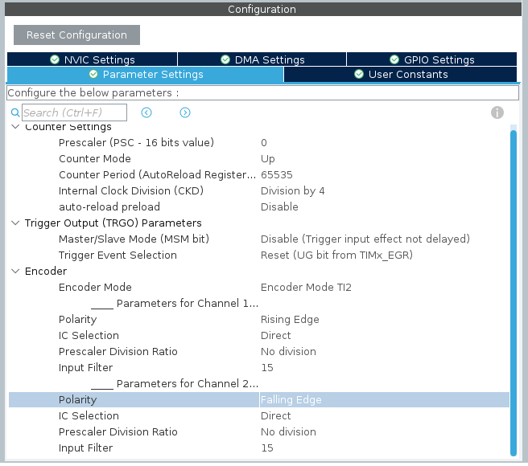

# Quadrature encoder

Objective of the project is to read a quadrature encoder, using the specific mode of STM32 timers, in order to provide the rotation frequency (expressed in rpm) and direction (“+” for clockwise and “-” for counterclockwise).

Steps:
1. Identify the encoder pins
2. Setup the timer to operate in encoder mode, with the correct input filter applied
3. Poll the counter value every second and compute the delta form the previous read, then convert it to rpms
4. Solve the overflow and underflow problems
5. Use a timer as a timebase and DMA to transfer the UART data

## 1. Finish project 1b

From studying the board schematics and looking at the board itself, we found that the two encoder signals are connected to `PC6` and `PC7`. In particular, the schematic shows that the `ENCODER_B` trace connected to PB3 is disconnected because the resistor `R84` was not mounted while `R106` is and thus the `ENC_B_ALT` trace connects `PC6` to the encoder's `B` signal.




To better understand how the encoder works, we found out the exact model: [EC12E1220407](https://tech.alpsalpine.com/e/products/detail/EC12E1220407/). It has 12 pulses, 12 dents (the number of snap positions) and no "marker" signal.

The encoder snaps in place where the `A` signal is high while the `B` signal could either be high or low because it is near its edge position. For this reason we decided to count the steps only with the A signal to avoid possible noise if the shaft is slightly moved.


One of the features of the STM32's General Purpose Timers is the support for quadrature encoders. This allows to count the encoder's position with an hardware peripheral instead of relying on software. The timer handles the two encoder's signals by counting up or down depending on the shaft rotation.

In particular, the timer can count on the edges of `TI1` (`TIM3_CH1`, `ENCODER_B`), on `TI2` (`TIM3_CH2`, `ENCODER_A`) or both. Counting on both signals provides the maximum resolution possible but, since our encoder has 12 dents to snap into, it is not so important.

One thing that we had an hard time understanding during testing was why the timer counts double the number of steps. By reading the reference manual ([RM0368](../../RM0368.pdf)) we found out that in encoder mode, the timer counts on both edges of the input signals. So for one step of the encoder, the timer sees a falling and then a rising edge of the signal and counts two units. In the CubeIDE configuration dialog of the timer, the "Polarity" specified for a given channel does not refer to the edge to count on but on the value to give to the events.

So to properly configure the timer we specified `Encoder Mode TI2`. We also used the maximum possible filter to prevent noise from interfering and we also set the polarity of channel 2 to `Falling Edge` to count up for clockwise rotations.



To handle the underflow and overflow events while using an `uint16_t` type variable we check if these problems have occurred and we count the difference in a different way.

We consider overflows and underflows occurring if the difference between the current and previous values is too great. If this is the case we need to count the difference differently.

```c
int diff;
uint16_t old_value, new_value;

...

if (old_value - new_value > 65535 / 2) {
    // Handle overflow
    diff = 65535 - old_value + 1 + new_value;
} else if (new_value - old_value > 65535 / 2) {
    // Handle underflow
    diff = -old_value - 65535 + new_value - 1;
} else {
    // Normal case
    diff = new_value - old_value;
}

old_value = new_value;
```